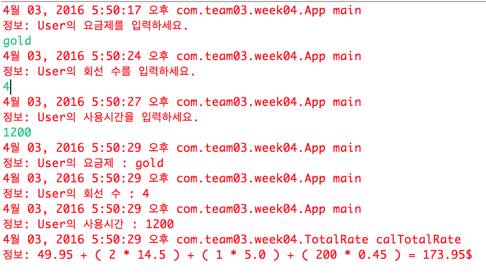
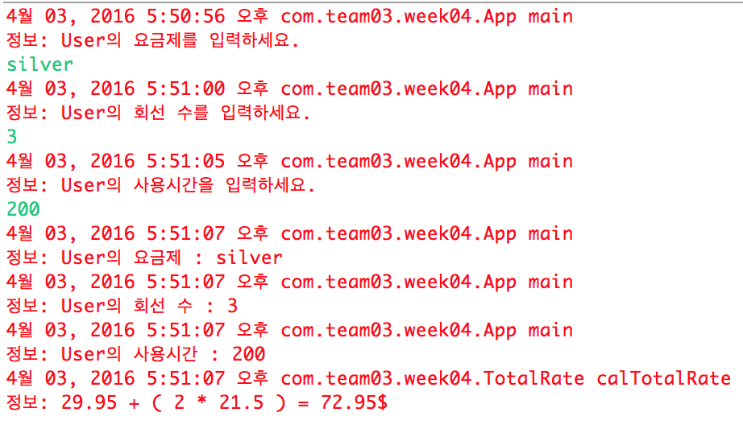

#전화요금 고지서 계산 프로그램
    이 프로그램은 전화 요금 고지서를 발행해주는 프로그램이다. 
    java기반 console 프로그램이며 eclipse 프로젝트로 실행 가능하다. 
    사용자에게 계산된 요금을 상세하게 보여준다. 
    
#jenkins - 프로젝트 설정
##Build
	Root POM : pom.xml
	Goals and options : package
##Post Steps
	Invoke Standalone SonarQube Analysis
		JDK : 1.8+
		Analysis properties : sonar.projectKey=Team03_week4
			  	      sonar.projectName=Team03_week4
				      sonar.projectVersion=0.0.1
				      sonar.sources=src
		JVM Options : -Xmx500m -XX:MaxPermSize=100m

#구성
App.java : main 함수를 포함한 클래스로 사용자 인터페이스는 console 화면으로 실행된다.
User.java : 사용자 정보를 담고 있는 클래스로 App.java에 입력받아 user객체로 저장한다.
PlanType.java : 요금제의 상위 클래스로 상속받아 실제 요금제의 정보를 입력할 수 있다.
Gold.java : Gold 요금제에 대한 정보를 담고 있는 클래스로 PanType 클래스를 상속받는다.
Silver.java : Silver 요금제에 대한 정보를 담고 있는 클래스로 PanType 클래스를 상속받는다.
TotalRate.java : 사용자 객체와 요금제 객체를 이용해 실제 청구될 금액을 계산해 준다.

#실행 방법

##1. Downloads the project

##2. Import Eclipse project

##3. Build

###3-1. Build maven project

##4. Excute
	go to project directory
	command : java -jar week4-0.0.1-SNAPSHOT.jar

##5. run

###5-1. insert your plan type.
		(ex. Gold, gold, Silver, silver)
###5-2. insert your number of lines.
		
###5-3. insert the used minutes

##6. Result

